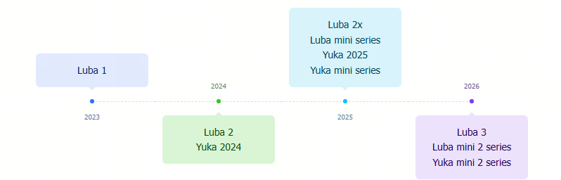

# Appearance and Version

## Product Iteration Timeline

## Product Appearance and Related Version

|Product name |No.|Product Appearance|Characteristics|
|:---|:---|:---|:---|
|**Luba series**|||
|Luba 1|Luba\-VF Luba\-VT||- 2 Cutting Disc（4 blades each） - Front bumper - AWD |
|Luba 2|Luba\-VS||- 2 Cutting Disc（4 blades each） - 2 Cameras - Front bumper - AWD|
|Luba 2x \(Luba Pro\)|Luba\-VP||- 2 Cutting Disc（6 blades each） - 2 Cameras - Front bumper - AWD|
|Luba 3|Luba\-VA||- 2 Cutting Disc（6 blades each） - LiDAR\+2 Cameras - Front bumper - AWD|
|**Luba mini series**|||
|Luba mini|Luba\-MN||- Single Cutting Disc（6 blades） - 2 Cameras - Front bumper - AWD|
|Luba mini LiDAR|Luba\-LD||- Single Cutting Disc（6 blades） - Rectangular LiDAR \+ 1 Camera - Front bumper - AWD |
|Luba mini 2 LiDAR 1500|Luba\-LA||- Single Cutting Disc（6 blades）\+ Side Cutting Disc（3 blades） - LiDAR \+ 2 Cameras - Front Bumper - AWD|
|Luba mini 2 Vision 1000|Luba\-MB||- Single Cutting Disc（6 blades）\+ Side Cutting Disc（3 blades） - 3 Cameras - Front Bumper - AWD|
|**Yuka series**|||
|Yuka 2025 \(Yuka Pro\) |Yuka\-YP  ||- 2 Cutting Disc（5 blades） - Sweeper Kit - 2 Cameras - 2 Driving Wheels \+ 1 Driven Wheel - No Front Bumper|
|Yuka 2024|Yuka\-YV||- 2 Cutting Disc（3 blades） - Sweeper Kit - 2 Cameras - 2 Driving Wheels \+ 1 Driven Wheel - No Front Bumper|
|**Yuka mini series**|||
|Yuka mini|Yuka\-MN ||- Single Cutting Disc（5 blades） - 2 Cameras - Manually Adjust Cutting Height - 2 Driving Wheels \+ 2 Driven Wheel - No Front Bumper|
|Yuka mini Vision 700|Yuka\-MV||- Single Cutting Disc（5 blades） - 3 Cameras - Manually Adjust Cutting Height - 2 Driving Wheels \+ 2 Driven Wheel - No Front Bumper|
|Yuka mini 2 Vision 800/500|Yuka\-MV||- Single Cutting Disc（5 blades） - Trinocular - Manually Adjust Cutting Height - 2 Driving Wheels \+ 2 Driven Wheel - No Front Bumper|
|Yuka mini 2 LiDAR|Yuka\-ML||- Single Cutting Disc（5 blades） - LiDAR \+ Binocular - Manually Adjust Cutting Height - 2 Driving Wheels \+ 2 Driven Wheel - No Front Bumper|

## LED Light Language

| Year | Applicable Models | Status & Meaning |
| :--- | :--- | :--- |
| **2026** |  • Luba 3  • Luba mini 2 LiDAR 1500  • Luba mini 2 Vision 1000 | **Solid Red:** The robot is functioning properly - Power on - Batterz Fully charged - Manual mode(Mowing) - Auto mowing  **Pulsing Red:** - Firmware update started - Firmware update in progress - Firmware update completed  **Slow Blinking Red:** - STOP button activated - Charging -  Locked status - Low battery - Mower stuck - Security key not properly installed - The mower has been lifted, tilted or flipped over  **Fast Blinking Red:** - Firmware update failed - System error |
| **2026** |  • Yuka mini 2 LiDAR 1000/800  • Yuka mini 2 Vision 800/500 | **Solid Green:** - The robot is functioning properly  **Pulsing Green:** - OTA update in progress - The robot is charging  **Blinking Blue:** - STOP Button activated - Charging - Locked Status - Low battery - Mower stuck - Security Key not properly installed - The mower has been lifted,titled, or flipped over  **Solid Red:** - Robot Malfunction - Robot update failed  **Off:** - The robot is power off - The robot is sleeping - The side LED is turned off in the app - The robot is in manual control mode but is currently inactive|
| **2025** |  • Luba 2x  • Luba mini LiDAR 1500 Luba mini 800/1500 | **Solid Red:** - Functioning properly  **Pulsing Red:** - OTA upgrade in progress - The robot is charging  **Slow Blinking Red:** - STOP Button activated - Low battery - Mower Stuck - Security Key is not properly installed - The mower has been lifted, titled, or flipped over  **Fast Blinking Red:** - Robot Malfunction - Robot update failed  **Off:** - Turned off - Sleeping - Side LED off in App - The robot is in manual control mode but is currently inactive |
| **2025** |  • Yuka mini Vision 700  • Yuka mini 500/600/700/800  • Yuka 2025 | **Solid Green:** - The robot is functioning properly  **Pulsing Green:** - OTA update in progress - The robot is charging  **Blinking Blue:** - STOP Button activated - Charging - Locked Status - Low battery - Mower stuck - Security Key not properly installed - The mower has been lifted,titled, or flipped over  **Solid Red:** - Robot Malfunction - Robot update failed  **Off:** - The robot is power off - The robot is sleeping - The side LED is turned off in the app - The robot is in manual control mode but is currently inactive|
| **2024** |  • Luba 2 | **Solid Red:** - System initialization - Manual control mode - Automatic working mode - Charging completed (The robot remains on the charging station)  **Pulsing Red:** - OTA upgrade in progress  **Slow Blinking Red:** - RTK positioning failed - STOP Button activated - The mower is charging  **Fast Blinking Red:** - Low battery - Powering off - Bumper triggered - Mower Stuck - RTK positioning failed - Robot has been lifted/tilted/flipped over  **Very Fast Blinking Red:** - System upgrade failed - OTA upgrade failed  **Off:** - Paused - Standby - Sleeping |
| **2024** |  • Yuka 2024 | Automatic working mode - Charging completed (The robot remians on the charging station) **Pulsing Green:** - OTA upgrade in progress  **Slow Blinking Green:** - The robot is charging  **Fast Blinking Red:** - Low battery - Bumper triggered - Mower Stuck - RTK positioning failed - The robot has been lifted, titled, or flipped over - Robot malfunction - Robot update failed  **Off:** - Turned off - Sleeping - Standby |
| **2023** |  • Luba 1 | **Solid Red:** - The robot is functioning properly/working  **Blinking Red:** - OTA upgrade in progress - No orientation/Positioning status is abnormal/No statellite found - STOP Button activated/Triggered - Slope exceeds the thereshold  **Fast Blinking Red:** - Robot malfunction - Robot update failed |

