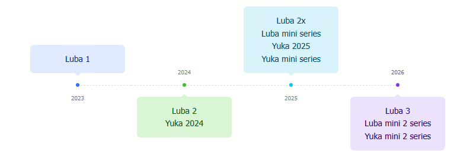

# Appearance and Version

## Product Iteration Timeline

## Product Appearance and Related Version

| Product name               | No.                  | Product Appearance                                            | Characteristics                                                                                                                                          |
| :------------------------- | :------------------- | :------------------------------------------------------------ | :------------------------------------------------------------------------------------------------------------------------------------------------------- |
| **Luba series**            |                      |                                                               |                                                                                                                                                          |
| Luba 1                     | Luba\-VF Luba\-VT |          | - 2 Cutting Disc（4 blades each） - Front bumper - AWD                                                                                            |
| Luba 2                     | Luba\-VS             |          | - 2 Cutting Disc（4 blades each） - 2 Cameras - Front bumper - AWD                                                                                |
| Luba 2x \(Luba Pro\)       | Luba\-VP             |         | - 2 Cutting Disc（6 blades each） - 2 Cameras - Front bumper - AWD                                                                                |
| Luba 3                     | Luba\-VA             |          | - 2 Cutting Disc（6 blades each） - LiDAR\+2 Cameras - Front bumper - AWD                                                                         |
| **Luba mini series**       |                      |                                                               |                                                                                                                                                          |
| Luba mini                  | Luba\-MN             |       | - Single Cutting Disc（6 blades） - 2 Cameras - Front bumper - AWD                                                                                |
| Luba mini LiDAR            | Luba\-LD             |  | - Single Cutting Disc（6 blades） - Rectangular LiDAR \+ 1 Camera - Front bumper - AWD                                                         |
| Luba mini 2 LiDAR 1500     | Luba\-LA             |  | - Single Cutting Disc（6 blades）\+ Side Cutting Disc（3 blades） - LiDAR \+ 2 Cameras - Front Bumper - AWD                                         |
| Luba mini 2 Vision 1000    | Luba\-MB             |  | - Single Cutting Disc（6 blades）\+ Side Cutting Disc（3 blades） - 3 Cameras - Front Bumper - AWD                                                  |
| **Yuka series**            |                      |                                                               |                                                                                                                                                          |
| Yuka 2025 \(Yuka Pro\)  | Yuka\-YP       |       | - 2 Cutting Disc（5 blades） - Sweeper Kit - 2 Cameras - 2 Driving Wheels \+ 1 Driven Wheel - No Front Bumper                                  |
| Yuka 2024                  | Yuka\-YV             |       | - 2 Cutting Disc（3 blades） - Sweeper Kit - 2 Cameras - 2 Driving Wheels \+ 1 Driven Wheel - No Front Bumper                                  |
| **Yuka mini series**       |                      |                                                               |                                                                                                                                                          |
| Yuka mini                  | Yuka\-MN          |       | - Single Cutting Disc（5 blades） - 2 Cameras - Manually Adjust Cutting Height - 2 Driving Wheels \+ 2 Driven Wheel - No Front Bumper          |
| Yuka mini Vision 700       | Yuka\-MV             |    | - Single Cutting Disc（5 blades） - 3 Cameras - Manually Adjust Cutting Height - 2 Driving Wheels \+ 2 Driven Wheel - No Front Bumper          |
| Yuka mini 2 Vision 800/500 | Yuka\-MV             |  | - Single Cutting Disc（5 blades） - Trinocular - Manually Adjust Cutting Height - 2 Driving Wheels \+ 2 Driven Wheel - No Front Bumper         |
| Yuka mini 2 LiDAR          | Yuka\-ML             |      | - Single Cutting Disc（5 blades） - LiDAR \+ Binocular - Manually Adjust Cutting Height - 2 Driving Wheels \+ 2 Driven Wheel - No Front Bumper |

